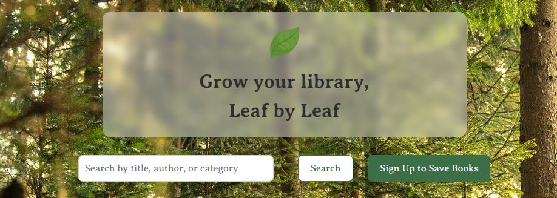
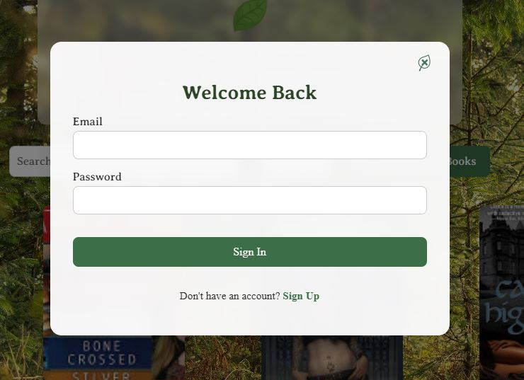
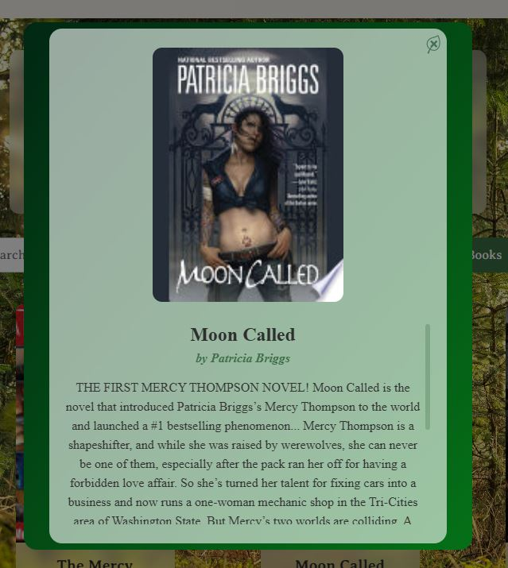
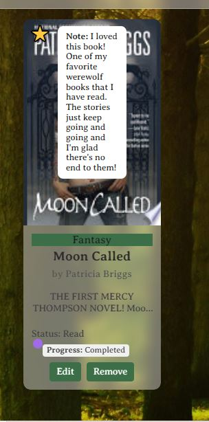

# Leafbound

Leafbound is a personalized, immersive book-tracking app that helps readers grow their digital library-leaf by leaf. Designed for comfort and customization, Leafbound offers a cozy, forest-themed interface with features built to support book discovery, organization, and progress tracking.

## Features

- **Search & Discover Books**  
  Browse books via Google Books API using keywords like title, author, or genre.

- **Save Books to Profile**  
  Save any book to your personal library with options to set:
  - **Reading Status**: Want to Read, Reading, or Finished
  - **Genre**: Custom genre tagging
  - **Notes & Tags**: Add notes and multiple tags
  - **Favorites**: Mark a book as a favorite for easy access
  - **Progress**: Track your reading progress

### Personalized Profile

- **User Authentication**  
  Secure sign-up, login, and logout using JWT.
- **Profile Header**  
  Display your profile picture and username; edit profile anytime.
- **Dark/Light Mode Toggle**  
  Switch between cozy light and dark themes.
- **Saved Books Library**  
  All your saved books shown with:
  - Genre badges
  - Reading status
  - Favorite indicators
  - Preview of notes
- **Edit & Remove Books**  
  Update or delete saved books directly from your profile.

### Advanced Filtering & Sorting

- **Search Bar on Profile**  
  Search by title, author, or genre within your saved books.
- **Filter Options**  
  Filter books by:
  - Reading status
  - Genre
  - Favorite status
  - Progress range
- **Sort Controls**  
  Sort by title, author, genre, date added, or progress (coming soon)

### UI Enhancements

- **Toasts and Animations**  
  Visual feedback when saving, editing, or removing books.
- **“You Recently Saved” Row**  
  Highlights your latest additions on the main page.
- **Forest Background and Cozy Typography**  
  Immersive visual design with accessibility in mind.

### Screenshots

This is on the main page, even users not logged in can still search up books.

Users can sign in or if they haven't created an account yet, they can switch to sign up.

Can click on a book to view the whole synopsis of the book, with a scroll bar for longer descriptions.

Once the book is saved to the users library, they're able to add if they have read the book, completed it or they do not want to read it anymore.

With the ability to favorite it, it'll create a star on the top left hand corner. Also with the ability to hover over the book to see any notes the user may have added.

### Tech Stack

- **Frontend**: React, Vite, Context API, CSS
- **Backend**: Backend with Express.js
- **API Integration**: Google Books API
- **Deployment**: GitHub Pages (Frontend)

## Git Hub link

[Visit the GitHub link](https://milialeana.github.io/leafbound-frontend/)

## Future Plans

- **Backend Persistence**
  - Migrate from simulated backend to a real database
  - Enable user-specific data saving and retrieval
- **Reading Goals**
  - Set annual/monthly reading targets and track progress
- **Statistics & Insights**
  - Visualize reading trends and genre distribution
- **Social Features**
  - Share favorite books or notes with friends
  - See what others are reading
- **Mobile Optimization**
  - Finalize full responsive design for all devices
- **Custom Book Covers**
  - Upload your own cover if Google Books doesn’t provide one
- **Import/Export Data**
  - Import existing book lists or export your saved books
- **Accessibility Enhancements**
  - Add full keyboard navigation and screen reader support
